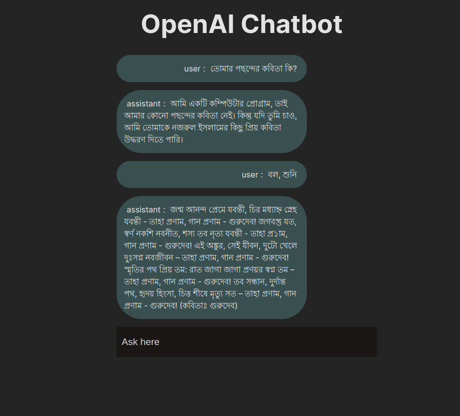

# React + Vite + ChatGPT project

## App view

## Dependencies
* [React](https://react.dev/)
* [OpenAI](https://openai.com/)
* [ChatGPT](https://platform.openai.com/)
* [Vite](https://vitejs.dev/)

## Installation
* Clone this repo `git clone https://github.com/Abdur-Rahim-sheikh/chat_web_application_using_gpt`
* Navigate into the repo `cd chat_web_application_using_gpt`
* Install the dependencies ``npm install``
* Start the local server ``npm run dev``

*That will open the project on your default browser : http://127.0.0.1:5173/ or localhost:5173*